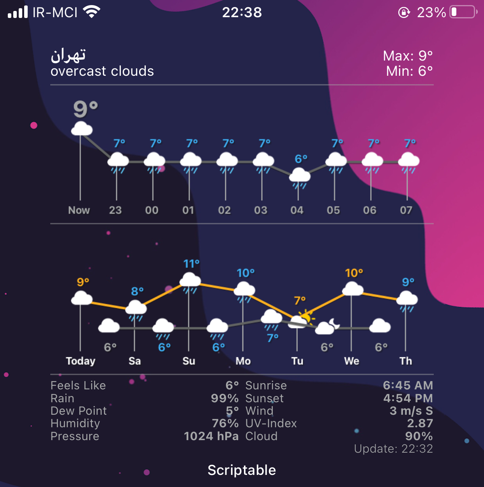

# Full-Weatherline-Widget

    

A proffesional large Weatherline widget for your glory screen, it has hours of day and 7 days of week with minimal weather info below. Colorful lines for either increase or decrease of your weather at any hour. With dynamic light/dark background or a preferable photo as transparent one. it has localization for any language.

Instruction:

1. Put your API code from openweathermap.org at Line 14.
2. Set locale language code at Line 17 (Please pay attention if you set this, the language of "city name" will be in your native language after step 3)
3. Turn on your "Location Services" for reading the name of city and for once and forever, you can turn it off after loading.
4. Screen Size:

if you are on large screen dievices such as Pro Max, XS Max, even XR, set the widget size according to:

Line 307: widget.padding = 0

if you are on old and small devices (like me :D ), don't need to change anything.

5. Widget has dynamic background for morning, afternoon and night and for setting this mode, you should do this:

Line 25: const imageBackground = false

And for using your gallery photos as a transparent type, do as:

Line 25: const imageBackground = true
Line 29: const forceImageUpdate = true

and after your selected proper photo: 

Line 29: const forceImageUpdate = false

6. Weather unit:

Line 253: units: "Metric"
          units: "Fahrenheit"
          units: "Imperial"
          
          
 7. Line 35: HoursToShow : number > Number of predicted hours to show, Eg: 3 = a total of 4 hours in the widget (Default: 3 for the small widget and 11 for the medium one).
 
const hoursToShow = 9
const daysToShow = 6   
          
Workable Widget Size: Large.

Note: The widget preview is for dev only, so ignore it if see something unusual. 
